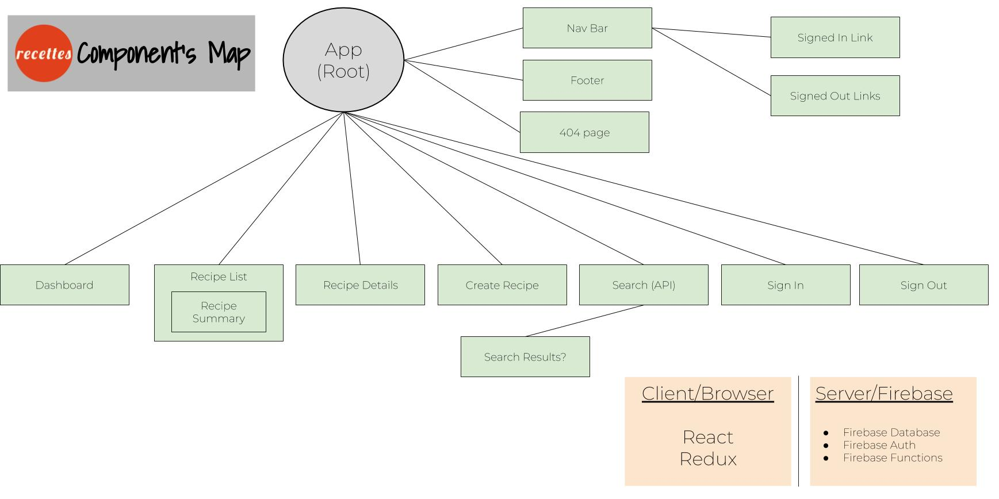
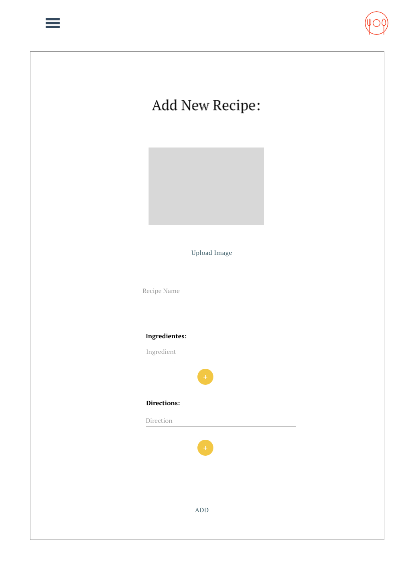
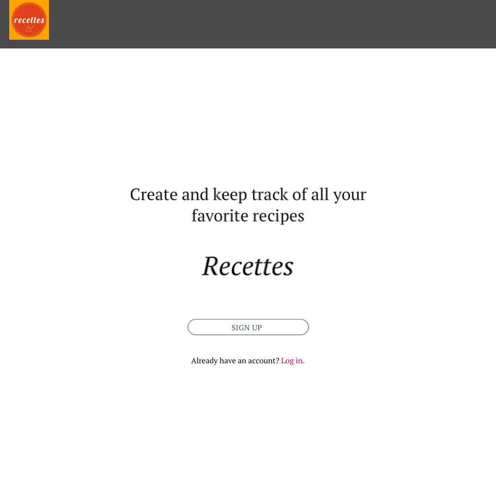

# Recettes

_Published_  5/3/2019  
_Author_ **Gary Bermudez**

# Project’s Purpose:

I want to create an app for people who wants to easily find recipes with ingredients they have available at home. Also, I would like to give to the user the ability to create and save their own recipes.

Here is a list of components I created for this project:

* App(Root)
* Dashboard: This component will display the recipe list component and the search results component
* Recipe Details: This component has the structure or model to represent a recipe
* Create Recipe: This component has a form so that the user can create a new recipe
* Search: Search for existing recipes(API)
* Sign In
* Sign Out
* Navigation: This component needs to have two different states: Logged in and Logged out states. Each state will display different links accordingly
* Footer: Footer links (still pending, not sure if I will need one)
* 404 Error: This is a custom error message for the application

This project was created using the React Library.

### Here is the app's component structure

### Sketch wireframes: 

# Setup/Installation Requirements

#### Prerequisites:
* npm package manager
* Node.js
* React

#### Cloning the Github repository (Mac OSX):

##### Important Note on  Firebase Credentials: If you decide to clone this repository, please make sure to acquire your own Firebase credentials and place them please them in a file `src/app/api-keys.ts`. See example below:

`export const masterFirebaseConfig = {
    apiKey: "xxxx",
    authDomain: "xxxx.firebaseapp.com",
    databaseURL: "https://xxxx.firebaseio.com",
    storageBucket: "xxxx.appspot.com",
    messagingSenderId: "xxxx"
  };`

* Open the Terminal in your computer
* Make sure you're in your Desktop directory
* Clone the repository `git clone`: https://github.com/garybm/recettes-react
* In your Terminal, navigate to the project site-rebuild
* Run `npm install` in the terminal to install dependencies
* Run `npm run start` in your terminal: The npm run startcommand launches the server. The `start` opens [http://localhost:3000](http://localhost:3000) to view it in the browser

### Known Bugs

* Media queries have not been applied, the site is currently available only on Desktop view.

### Technologies Used
* React
* JSX
* CSS
* HTML
* Firebase (to be implemented)
* Adobe Spark
* Adobe Capture
* Materialize from Google: A modern responsive front-end framework based on Material Design
* Facebook for developers: Social Plugins

## Support and contact details

_Email garybm.17@gmail.com if you have any questions_

## License

This software is licensed under the MIT license.

Copyright (c) 2018 **Gary Bermudez**

## Available Scripts

In the project directory, you can run:

### `npm start`

Runs the app in the development mode. 
Open [http://localhost:3000](http://localhost:3000) to view it in the browser.

The page will reload if you make edits. 
You will also see any lint errors in the console.

### `npm test`

Launches the test runner in the interactive watch mode. 
See the section about [running tests](https://facebook.github.io/create-react-app/docs/running-tests) for more information.

### `npm run build`

Builds the app for production to the `build` folder. 
It correctly bundles React in production mode and optimizes the build for the best performance.

The build is minified and the filenames include the hashes. 
Your app is ready to be deployed!

See the section about [deployment](https://facebook.github.io/create-react-app/docs/deployment) for more information.

### `npm run eject`

**Note: this is a one-way operation. Once you `eject`, you can’t go back!**

If you aren’t satisfied with the build tool and configuration choices, you can `eject` at any time. This command will remove the single build dependency from your project.

Instead, it will copy all the configuration files and the transitive dependencies (Webpack, Babel, ESLint, etc) right into your project so you have full control over them. All of the commands except `eject` will still work, but they will point to the copied scripts so you can tweak them. At this point you’re on your own.

You don’t have to ever use `eject`. The curated feature set is suitable for small and middle deployments, and you shouldn’t feel obligated to use this feature. However we understand that this tool wouldn’t be useful if you couldn’t customize it when you are ready for it.

## Learn More
